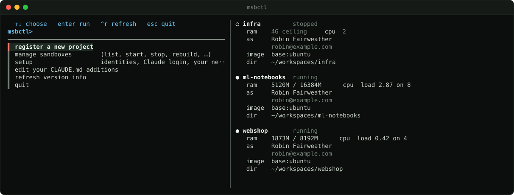
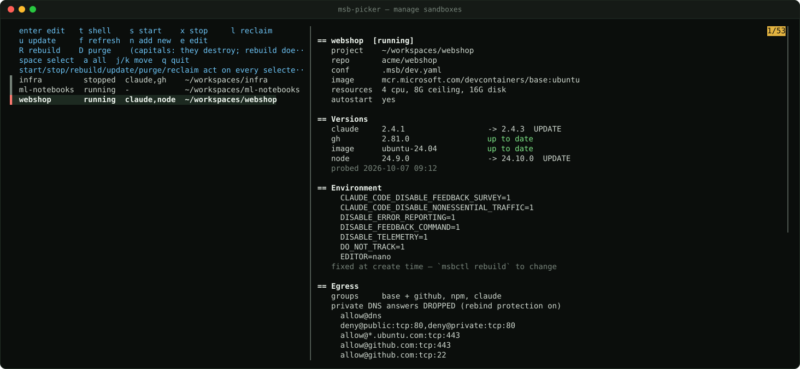
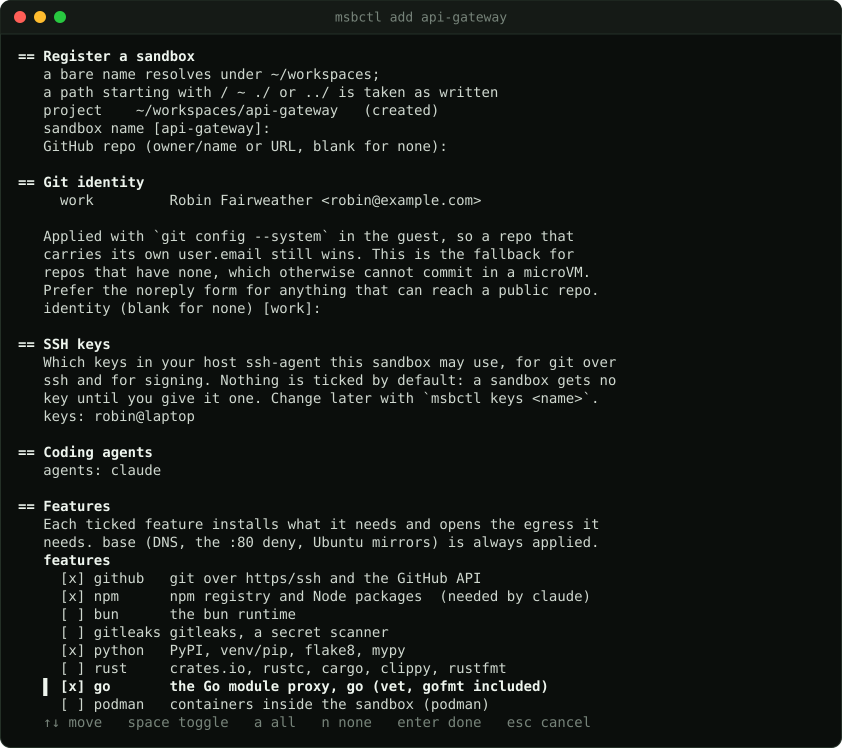

<p align="center">
  
</p>

<h1 align="center">msb-manager</h1>

[](https://github.com/runoverlabs/sandbox-manager/actions/workflows/ci.yml)
[](https://github.com/runoverlabs/sandbox-manager/actions/workflows/codeql.yml)
[](https://scorecard.dev/viewer/?uri=github.com/runoverlabs/sandbox-manager)
[](https://github.com/runoverlabs/sandbox-manager/releases/latest)
[](LICENSE)

Manage [microsandbox](https://github.com/microsandbox/microsandbox) microVMs as
per-project agent sandboxes: deny-by-default egress, credentials that never
enter the VM, and one picker to start, stop, rebuild and update them all.

Built for running coding agents against real repositories without giving them
your network or your tokens.

**Documentation: <https://sandbox-manager.runoverlabs.dev/>**



## What it actually does

**Egress is deny-by-default, per host and per port.** Rule groups are named in
one config file and composed per project: `github`, `npm`, `python`, `go` and
so on, plus whatever you add. A sandbox that needs SSH to one machine gets that
port on that machine, not the machine.

**Tokens never enter the guest.** `msb`'s `--secret ENV@HOST` puts an opaque
placeholder in the sandbox's environment and substitutes the real value
host-side, into request headers only, on egress to named hosts. Inside the VM
`$GH_TOKEN` reads as `$MSB_GH_TOKEN`. `gh api user` still works.

**SSH is a forwarded agent over vsock.** The protocol crosses; the key does
not. `git push` works where the remote is SSH.

**One `CLAUDE.md` you control centrally** — msb-manager's shipped text plus your own
additions — copied into every sandbox on each start from a read-only mount the
guest cannot edit. Each sandbox gets its own
`~/.claude`, so no sandbox holds your real Claude credentials or any other
project's transcripts.

**Per-project config travels with the repo.** Egress groups, bootstrap extras
and resource limits live in the project's `.msb/`; host paths and tokens stay
in `~/.config/msb/` and are never committed.

## A look around

These are the real screens, run against invented sandboxes;
`scripts/screenshots/make.sh` regenerates them.

**`msb-picker`**, which the desktop entry opens: every sandbox with its state and
pending updates, one key per action, and everything about the one under the
cursor — versions, environment, every egress rule, credentials.



**`msbctl add`** asks for features, not firewall rules: each one brings the
packages and the egress it needs.



## Requirements

- Linux with `/dev/kvm` — microsandbox is a libkrun microVM runtime, so this
  runs on a host, never inside a container
- [`msb`](https://github.com/microsandbox/microsandbox) on `PATH` (developed
  against 0.7.6)
- Python **3.11+** — stdlib only, no pip install, ever
- `git`
- `fzf` — optional. It upgrades the menu and provides the picker; without it
  `msbctl` falls back to a numbered prompt and tells you what it cannot do
- a terminal emulator for the desktop entry (konsole, alacritty, foot,
  gnome-terminal and xterm are all detected)

## Install

```sh
curl -fsSL https://github.com/runoverlabs/sandbox-manager/releases/latest/download/get.sh | sh
```

`get.sh` finds the latest release, downloads it, **verifies its sha256** against
the checksums published with it (and installs nothing if they differ), and runs
the installer inside it. If an authenticated [`gh`](https://cli.github.com) is
installed it also verifies the tarball's **build provenance** (see below). Pin a release with `sh -s -- --version v0.2.2`; other
flags (`--prefix`, `--bin-dir`, `--no-desktop`) go to the installer.

That is a **package install**: the tree is copied to
`~/.local/share/msb-manager/versions/<version>/`, `current` points at it, and
`~/.local/bin/msbctl` and `msb-picker` link through `current` — so an upgrade is
one atomic switch, the previous version stays for rolling back, and nothing
depends on a checkout. Everything is real files; the installer refuses a tree
that contains symlinks.

```sh
msbctl self-update            # latest release; --version v0.2.2 for a specific one
~/.local/share/msb-manager/current/install.sh --uninstall   # your config and sandboxes stay
```

### From a checkout (development)

```sh
git clone https://github.com/runoverlabs/sandbox-manager msb-manager
cd msb-manager
./install.sh                  # --dev is implied inside a git checkout
```

Dev mode symlinks the two commands into the checkout, so `git pull` updates the
tool with no reinstall. Everything below is the same in both modes.

### What is yours and what ships

Two files you edit are **real files, never links into the tree**, and an install
or upgrade never overwrites them:

- `~/.config/msb/config.toml` — your overrides on top of the shipped `defaults.toml`
  (egress rule groups, version pins, baselines). The two are merged, yours winning;
  `msbctl config` prints the result and where each value came from.
- `~/.config/msb/CLAUDE.local.md` — your additions to the `CLAUDE.md` every sandbox
  gets. msb-manager ships the central text; at each start it is assembled with
  yours into `~/.local/state/msb/profile/`, which is what sandboxes see
  (read-only). `msbctl` menu → "edit your CLAUDE.md additions".

The first run of `msbctl` offers a short walk-through (identities, Claude login,
your own network); `msbctl setup` returns to any of it.

### Verifying a release

The checksum published beside a tarball only proves the download was not damaged:
whoever could replace the tarball could replace the checksum. Each release is
therefore also **attested** — a Sigstore-signed statement, made by this
repository's release workflow, of exactly which commit built which file. Check it
yourself:

```sh
gh attestation verify msb-manager-0.1.0.tar.gz --repo runoverlabs/sandbox-manager \
    --signer-workflow runoverlabs/sandbox-manager/.github/workflows/release.yml
```

`get.sh` and `msbctl self-update` run that check automatically when `gh` is
logged in, refuse to install on a failure, and say plainly when they could only
check the checksum. `MSB_MANAGER_SKIP_ATTEST=1` skips it. From 0.2.4 on the
attestation is also a release asset, `msb-manager-X.Y.Z.intoto.jsonl`, for
`gh attestation verify --bundle`.

### Releasing

Releases are cut by tag, never by hand: move the `CHANGELOG.md` **Unreleased**
entries under the new version, set `VERSION`, merge, then
`git tag vX.Y.Z && git push origin vX.Y.Z`. The release workflow checks that the
tag, `VERSION` and changelog agree, builds the assets, attests them and
publishes. To build the same assets locally (without publishing):

```sh
scripts/package.sh --version 0.2.0 --repo runoverlabs/sandbox-manager   # writes ./dist
```

`scripts/package.sh` copies an explicit list of files (not `.msb/`, `AGENTS.md`, `CLAUDE.md` or
itself), fails on any symlink or `.env`-looking file, normalizes modes, and builds
a reproducible tarball plus the repository-bound `get.sh` and `checksums.sha256`.
It does not publish.

### Credentials, once

```sh
claude setup-token          # paste into ~/.config/msb/secrets/global.env
```

For GitHub, create a **fine-grained PAT per project** at
<https://github.com/settings/personal-access-tokens/new>, scoped to that one
repository. `msbctl add` prints the exact permissions and reads the token
straight into a 0600 file — never echoed, never in `argv`, never inside the
project tree.

There is deliberately no automation for this: GitHub has no API for creating
fine-grained PATs, and a GitHub App's installation tokens expire after one
hour, which is too short for a binding resolved once at sandbox start.

## Use

```sh
msbctl                        # the menu
msbctl add myproject          # register (wizard); creates ~/workspaces/myproject
msbctl start myproject
msbctl shell myproject
msbctl show myproject         # resources, versions, every emitted egress rule
```

Or open the **Sandboxes** desktop entry, which lists every registered sandbox
with its state and what is out of date inside it, and binds a key to each
action.

Full command list, the two project layouts, how rules compose, and what is
fixed at create time versus changeable on restart: run `msbctl --help`, and
read the comments in `defaults.toml`. They are the documentation.

## Why the config files are so heavily commented

Because the failure modes are not guessable, and several of them are disguised.

A hostname rule only means a hostname over HTTPS — on any other port nothing
inspects the traffic and the rule degrades to "the addresses that name resolved
to", which breaks against address pools. DNS resolution is part of a rule, not
a separate concern, so a name msb cannot resolve fails *identically* to one you
never allowed. Rules are first-match-wins, so a leading deny cannot be undone
by appending an allow.

Every one of those cost a debugging session. The comments are where that went.

## Verifying it

`spikes/` holds one re-runnable script per mechanism the design depends on:
the agent bridge, mount ownership and read-only mounts, per-port rule
precision, persistence, hostname-rule enforcement, memory reclaim, both token
placeholders, profile seeding, and DNS rebind protection.

```sh
./spikes/07-claude-token-secret.sh
```

They run against your host and print `PASS` or `FAIL` with a reason. Several
require you to set addresses for your own network first — there are no
defaults, because a wrong guess makes a spike pass for the wrong reason.

Each asserts **both** halves of what it claims: that the allowed thing works
*and* that the denied thing is still denied. A rule set that permits the one
service you need is worthless if it also permits the admin interface next to
it, and only the negative half catches that.

## Status

Developed against microsandbox 0.7.6 on Fedora, for one operator's machine. It
is small, dependency-free, and commented for the person who has to debug it at
2am — but it has not been run anywhere else, and `msb --help` is a more
reliable guide to that tool than its published documentation.

Issues and PRs welcome, particularly from anyone running a different distro or
a newer `msb`. See [CONTRIBUTING.md](CONTRIBUTING.md); vulnerabilities go through
[SECURITY.md](SECURITY.md), not an issue.

## Licence

MIT — see [LICENSE](LICENSE).
